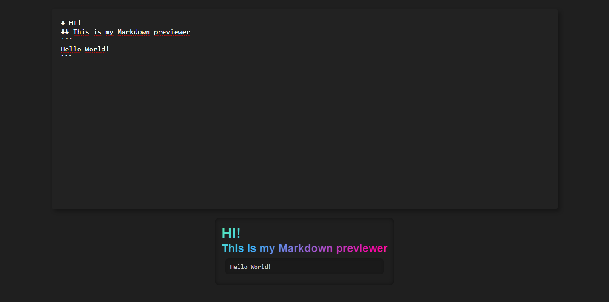

## FreeCodeCamp "Markdown Previewer" Project
This is a project for FreeCodeCamp's Front End Development Libraries certification.

Here's my [Front End Development Libraries certification](https://www.freecodecamp.org/certification/andresprza/front-end-development-libraries).

### Run the app

you can check the project on its [codepen](https://codepen.io/andresprza/full/LYdbQJX).

Or you can run the project locally if you have [Node.js](https://nodejs.org/en/) installed. First, open a terminal on an empty folder and clone the repo with:
```
git clone https://github.com/AndresPrza/FCC-Markdown-Previewer.git
```
Install the dependencies with:
```
npm install
```
And run the app with:
```
npm start
```


### Project status
This project is **finished** and i have no plan on updating it at the moment.

### Preview


### Test Markdown
You can use the following markdown to test the app easily:
~~~
# Header

## Sub header
[link](https://github.com/AndresPrza)

code:
`<div></div>`

```
Codeblock:

const abba = (a) => {
function(b){
return b + a;
}
}
```

You want a list?
1. Here's a list.
+ A list item.
2. Here's another.
+ another list item
+ and another

> Block Quotes!

**Bold Text**


~~~
