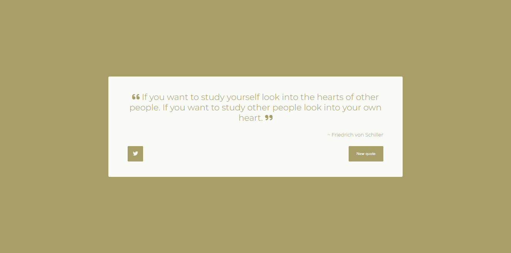

## FreeCodeCamp "Random Quote Machine" Project
This is a project for FreeCodeCamp's Front End Development Libraries certification.

Here's my [Front End Development Libraries certification](https://www.freecodecamp.org/certification/andresprza/front-end-development-libraries).

### Run the app

you can check the project on its [codepen](https://codepen.io/andresprza/full/rNdMwmR).

Or you can run the project locally if you have [Node.js](https://nodejs.org/en/) installed. First, open a terminal on an empty folder and clone the repo with:
```
git clone https://github.com/AndresPrza/FCC-Random-Quote-Machine.git
```
Install the dependencies with:
```
npm install
```
And run the app with:
```
npm start
```

### Project status
This project is **finished** and i have no plan on updating it at the moment.

### Preview

